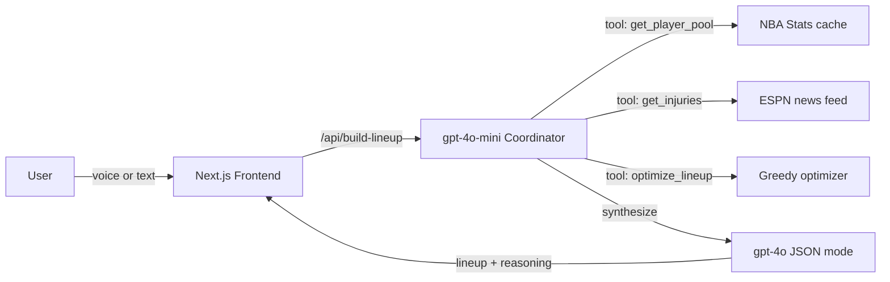

# FanDraft

**AI-coached fantasy lineup builder.** Voice in, lineup out, with per-pick reasoning grounded in live injury news — in under 10 seconds.

Built in 90 minutes at Cursor Boston × Hult Sports Hack 2026 using Cursor agent mode.

## Demo

- **Live:** [insert Vercel URL]
- **Loom:** [insert Loom URL]

## The problem

DFS players spend 45 minutes a night doing the same three things: pulling projections, scanning injury news, fitting 8 players under $50K. Existing optimizers are spreadsheets in disguise. FanDraft does it as a conversation.

## Track

**Fan & Audience Experience.** DFS engagement is fan engagement — this is built for the millions of casual players who want sharp lineups without the 45-minute research grind.

## The triad

- **One user:** the casual DFS player on DraftKings or FanDuel
- **One problem:** 45 minutes of pre-tipoff research (projections, injury news, salary math)
- **One product:** voice in, lineup out, in 10 seconds, with reasoning

## How it works

A coordinator agent (OpenAI gpt-4o-mini) calls three tools via OpenAI function calling:

1. **get_player_pool** — returns tonight's eligible Spurs and Thunder players with projected fantasy points and salaries
2. **get_injuries** — pulls recent injury articles from ESPN's public news feed (live)
3. **optimize_lineup** — greedy, position-aware lineup builder under the $50K cap

A final synthesis call (gpt-4o) generates per-pick reasoning in JSON mode. The browser's Web Speech API handles voice in and out.

## Architecture



## Stack

- Next.js 14 (app router) + TypeScript + Tailwind, deployed on Vercel
- OpenAI API: gpt-4o-mini for tool-calling, gpt-4o for synthesis
- NBA Stats API (pre-cached) + ESPN injury feed (live)
- Web Speech API for voice in/out
- Built end-to-end in Cursor agent mode

## What's honest

DraftKings doesn't publish salaries publicly. We project them from season averages using DK's public scoring formula: 1 pt per point + 1.25 per rebound + 1.5 per assist + 2 per block + 2 per steal − 0.5 per turnover. The optimizer is greedy, not globally optimal — sufficient for a 90-minute build, replaceable with an ILP solver later.

## Roadmap

- Player-level Vegas prop integration for ceiling modeling
- Multi-slate support (MLB, NFL) — same agent shape, new prompt + data tool
- Backtesting harness against historical DK contests

## Run locally

```bash
npm install
echo "OPENAI_API_KEY=sk-..." > .env.local
npm run dev
```

The data/ folder is committed — no NBA API access needed for local dev.

---
